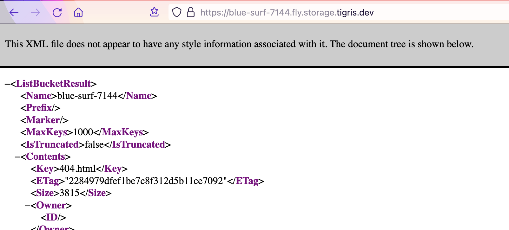

+++
title = "Hosting a Static Site on a Fly.io Tigris Bucket"
date = "2024-03-29"
tags = ["tech", "meta"]
draft = true
+++

## Introduction

In the past (and currently) I've hosted static sites on *Github* and *Netlify*.

I thought I would give *Fly.io*'s `Tigris` integration a try. They are a S3-compatible blob storage service, and they have a generous free tier (something like free bandwidth and 5GB of storage).. plenty for a static blog site!

## Set-up

* Sign up for a [Fly.io](https://fly.io/app/sign-up/) account (painless - though you do need to supply a credit card)
* Brew install `awscli` and `flyctl`.
* Auth to `flyctl`
* Create the Tigris bucket, initially I'm using a random name, and I'll use this as my dev domain:

```shell
$ flyctl storage create
? Select Organization: *** *** (personal)
? Choose a name, use the default, or leave blank to generate one:
Your Tigris project (blue-surf-7144) is ready. See details and next steps with: https://fly.io/docs/reference/tigris/

Set the following secrets on your target app.
AWS_ACCESS_KEY_ID: tid_<snip>
AWS_ENDPOINT_URL_S3: https://fly.storage.tigris.dev
AWS_REGION: auto
AWS_SECRET_ACCESS_KEY: tsec_<snip>
BUCKET_NAME: blue-surf-7144

$ flyctl storage ls
NAME            ORG
blue-surf-7144  personal
```

* Then I created a `tigris` AWS cli profile using the above credentials:

```shell
$ cat .aws/config
[tigris]
region = auto

~$ cat .aws/credentials
[tigris]
aws_access_key_id = tid_<snip>
aws_secret_access_key = tsec_<snip>
endpoint_url=https://fly.storage.tigris.dev
```

* And verified I had set the AWS-like creds up correctly:

```shell
$ aws --profile tigris s3 ls
2024-03-29 14:12:48 blue-surf-7144
```

## Deploying To The Bucket With Hugo

I added this to my `hugo.toml` file.

Note the overrides in the `s3://` URL needed:
* `endpoint=https://fly.storage.tigris.dev` (Tigris specific)
* `region=auto` (Tigris specific)
* `profile=tigris` (you could skip this if you set your aws profile name to `default`)
```shell
[deployment]
[[deployment.targets]]
name = "dev"
URL = "s3://blue-surf-7144?region=auto&endpoint=https://fly.storage.tigris.dev&profile=tigris"
```

I got the deploy working on my second try (woo), the first time failed as I had not specified the `profile=dev` argument. The error message was clear enough `NoCredentialProviders: no valid providers in chain. Deprecated.`.

Then I can verify that I can now deploy my site using `hugo deploy dev`.

```shell
$ hugo deploy dev
Deploying to target "dev" (s3://blue-surf-7144?region=auto&endpoint=https://fly.storage.tigris.dev&profile=tigris)
Identified 18 file(s) to upload, totaling 94 kB, and 0 file(s) to delete.
Success!
Success!
```

I verified that we can get the `robots.txt` in curl..
```shell
$ curl https://blue-surf-7144.fly.storage.tigris.dev/robots.txt
User-agent: GPTBot
Disallow: /
```

Time to fire up a Firefox tab... and bask in glory.. Oh no..



## To Be Continued

So it looks like [Tigris don't yet support](https://community.fly.io/t/static-site-no-server-possible/18822/2) **Index Documents** so I can't use them yet. The engineer replying to that thread said they are working on adding the feature soon, so watch this space..
