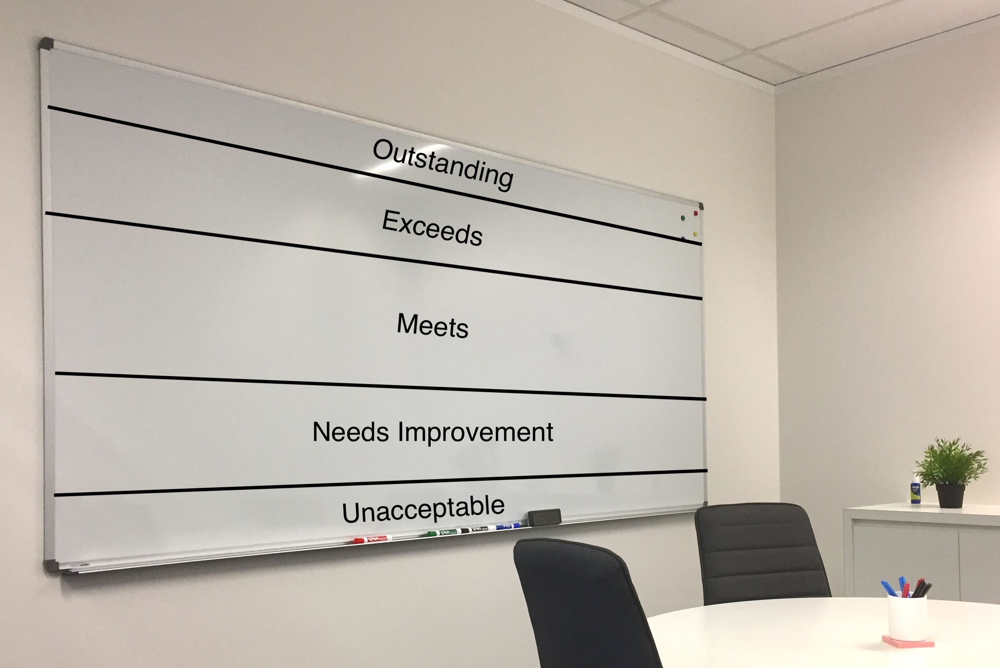
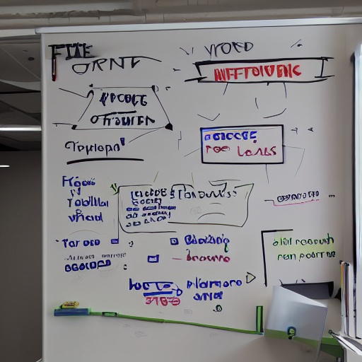
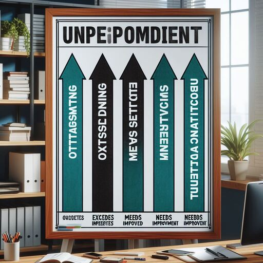
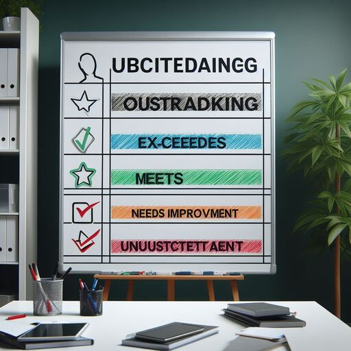

+++
title = "Story Time: Job #3 Part 2: Big NHS Project: More Stories"
date = "2024-04-20T17:03:14-03:00"
tags = ["storytime"]
+++

This is Part 2 - if you haven't already see [Part 1](/blog/2024/04/story-time-job-03-p1-big-nhs-project/)

## Annual Performance Review

One of the benefits of being on the 24/7 shift team, was that you felt kinda disconnected and outside of the politics and day to day grind of the Mon-Fri 9-5 workers. You would phase in and out of sync with the Mon-Fri lot, you would have an eclipse every so often when your two day shifts landed on the two weekend days. This meant you might not see our bosses face-to-face for the best part of 2 weeks. :smiley:

But our peace was disturbed when **Annual Performance Review** time rolled around. We got increasingly shrill emails nagging us individually, and collectively to pressure us to fill in the paperwork.

There was no avoiding it.. so we spent more hours than you would like to filling in a huge Microsoft Word document with large blank text boxes and vague questions like:

> "Give an example where you have gone the extra mile to add value to the client?"

> "Where do you see your career in the next 5 years?"

> "Indicate how you have met the company's core values in your client delivery work?"

.. and for added bonus points, you had to have solicited and provided evidence of Internal / External colleagues giving you kudos/praise for your work... which nobody knew they had to do.

This was a huge pain, and 90% of the things they asked for were not relevant to me. I didn't deal with clients, I had no say in the work I was given, and it all seemed like paperwork for the sake of paperwork.

I got my paperwork filled in on time, and then we waited to hear the results. Your payrise, job prospects, whether they would fire you or not, it depended on whoever judged your paperwork. I think I got the middle-of-the-road *Meets* result for what it was worth.

I did hear through the grapevine about what the *actual* process was:

1. All the paperwork was printed and collected.
2. The paperwork was carefully thrown into the **Sensitive Recycling Bin** :recycle:.
3. The Managers met in a meeting room with a huge whiteboard divided into 5 segments.

> Excuse the awful image editing. See the footnote if you want to see what the AI image generators shat out [^bignote] 

4. Every worker's name was scrawled on a Post-It Note and stuck in the middle *Meets* section.
5. Managers would take turns to move one Post-It up or down.
6. They would horse trade "Oh if your Bob is getting Outstanding then you have to give my Alice Outstanding too".
7. (this would last several hours)
8. Your rankings are done! Thanks for playing!

## Quitting

I was not learning anything in this job and it was horrendously boring, *and* it looked like the [Big Consulting Company was planning to quit the NHS contract entirely](https://www.theregister.com/2006/09/28/accenture_failure_success/) and offload it to someone else.

So I jumped ship and handed my notice in. I got a slew of emails from HR, two of which I remember:-
1. An email with LOTS OF ALL CAPS warning me on pain of **DEATH** not to **DESTROY** any data and to **RETURN** my hard drive to *Address in Chicago, IL, USA*. This was related to an expected Shareholder Lawsuit related to the eye watering *FOUR HUNDRED AND FIFTY MILLION DOLLARS ($450M)* in losses they had made on the NHS contract.

> I replied saying "I'm not returning it to you in Chicago, IL, if you want it you can come and get it from *Leeds, England*."

2. An email asking me to arrange a *Leaving Interview* with HR.

> I ignored this. I have no problem giving feedback, but of all the companies I've worked for, this felt to me like the biggest waste of time to assume that anything I said would be acted upon or could do anything about the madness. 

HR called me during my last week at the company asking why I hadn't arranged the interview. I told them I hadn't arranged it as I didn't want to do a leaving interview. They asked me why not? I said if I told them "why not?" that would be a form of leaving interview...

My last day on the job was a night-shift, and I had my lunch in the break room watching something on the big screen TV around midnight. When I tried to swipe back into our office, my card beeped and showed a :red_circle:... They had disabled my access at midnight :joy:. I had to borrow a colleague's card to escape up to reception and talk the security guard into giving me a visitor's badge until the end of my last shift.

## What Did You Learn From This Job?

Not a lot. It was my first job in contact with *Contractors* though, which planted the seed in my head that there might be *A Better Way* to work (foreshadowing).

But it looked impressive on my CV, and it cemented me as worthy of *Doing Server Stuff* to future employers :heart:

[^bignote]: What happens when you ask AI to generate images of a *whiteboard in an office with 5 horizontal lines labelled...*:

    
    
    
