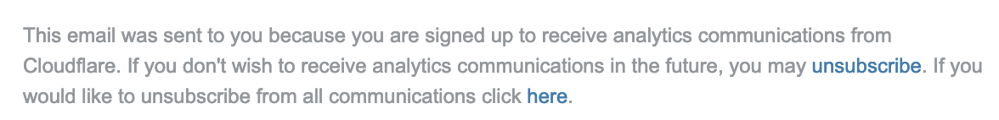
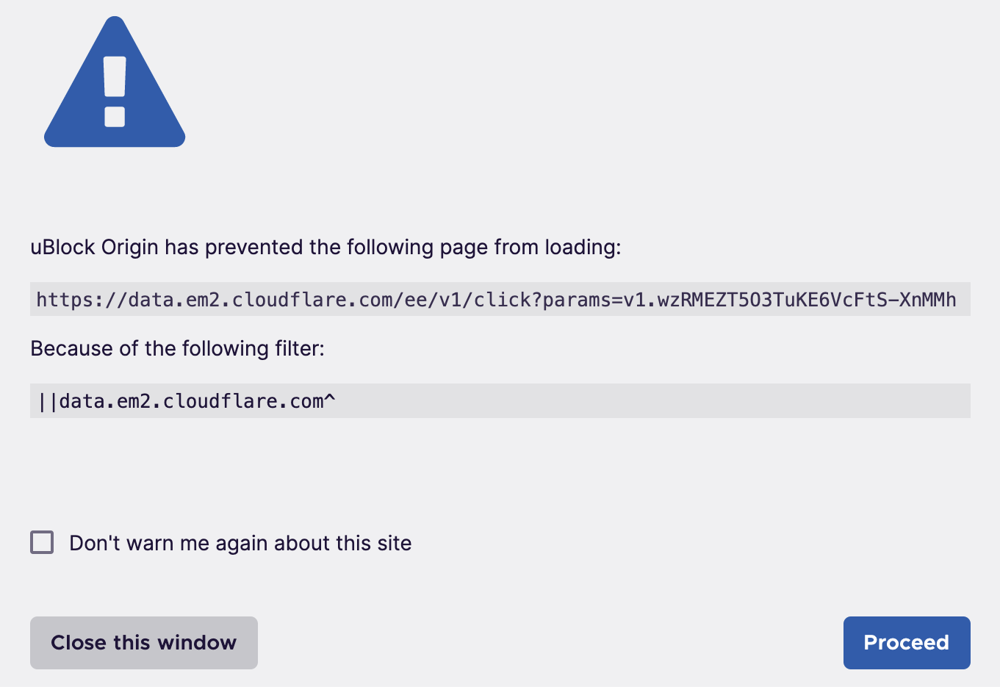
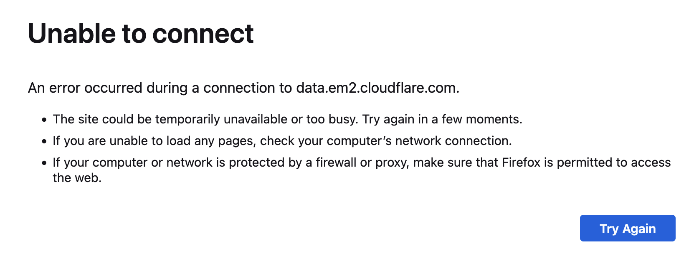

+++
title = "One-Click Email Unsubscribe.. with curl"
date = "2024-05-15T23:00:00-03:00"
tags = ["tech"]
+++

An annoying pattern about giving a company an email address (especially one that isn't in a country subject to the [GDPR](https://en.wikipedia.org/wiki/General_Data_Protection_Regulation)), is that I often will get opted-in, without my consent, to a spam list.

I am pragmatic and accept that I'm going to hit `unsubscribe` once (and no more than once) before I block the tagged email address I've given the company... but often when I do click `unsubscribe` I get this awful workflow:

## Step 1: Find the tiny unsubscribe text in the email



## Step 2: Click through the uBlock Origin Tracker Blocking

I use the uBlock Origin adblocking extension, which I can bypass easily..



## Step 3: :x: Can't Unsubscribe as NextDNS Blocks the Tracker

..but now [NextDNS](https://nextdns.io/) blocks the tracker.. which is many more clicks to add an exception (or to change the browser settings to chose a different DNS-over-HTTPS provider)... so at this point I usually give up :woman_shrugging:



# List-Unsubscribe=One-Click to the Rescue!

The proverbial [800lb Gorillas](https://en.wikipedia.org/wiki/800-pound_gorilla) of Google Mail and Yahoo *!* Mail last year [both](https://blog.google/products/gmail/gmail-security-authentication-spam-protection/) [announced](https://blog.postmaster.yahooinc.com/post/730172167494483968/more-secure-less-spam) they would be requiring that bulk senders had to improve a few things if they wanted to have their ~~spam~~ messages delivered.

The requirement that is useful to this post is:-

> 2. Enable easy unsubscription: You shouldn’t have to jump through hoops to stop receiving unwanted messages from a particular email sender. It should take one click. So we’re requiring that large senders give Gmail recipients the ability to unsubscribe from commercial email in one click, and that they process unsubscription requests within two days. We’ve built these requirements on open standards so that once senders implement them, everyone who uses email benefits.

The [open standard](https://datatracker.ietf.org/doc/html/rfc8058) in question requires that you set the header:

> `List-Unsubscribe-Post: List-Unsubscribe=One-Click`

So view the source of an email you wish to unsubscribe from and if you see that header you can grab the `https://` link from the `List-Unsubscribe:` line.

Then you can unsubscribe with one "click" of `curl`:

```shell
# set this to the https URL found in the List-Unsubscribe
# header in the message source
UNSUB="https://data.em2.cloudflare.com/ee/v1/click?params=v1.wzR...snip"
curl -X POST \
  -F List-Unsubscribe=One-Click \
  --doh-url https://wikimedia-dns.org/dns-query \
  -v $UNSUB
```

(This also allows us to use the `--doh-url` option in `curl` to bypass any local DNS blocking you may be doing by using a public non-adblocking DoH server. In this example I'm using [Wikimedia DNS](https://meta.wikimedia.org/wiki/Wikimedia_DNS), but you could use your favourite [Public DNS Resolver](https://en.wikipedia.org/wiki/Public_recursive_name_server#Notable_public_DNS_service_operators).)

If the sender responds with something that looks successful, then that should give you as much hope as clicking through a browser to unsubscribe. Here is an example response I got:-

```
< HTTP/1.1 202 Accepted
Unsubscribe Request Accepted
```

(This blog post is mainly a way of documenting this for myself, beyond hitting CTRL+R and hoping the `curl` command above is still in my shell history :nerd_face:)