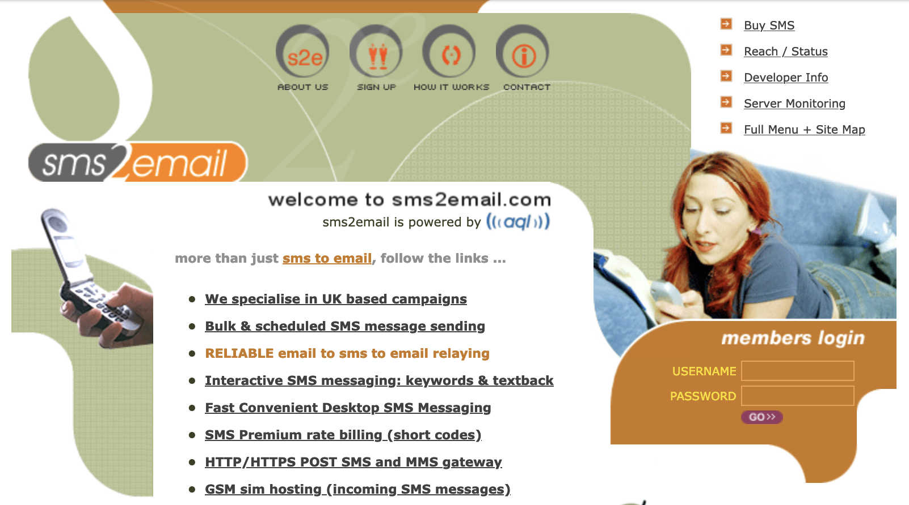

+++
title = "Story Time: Job #5: Part 3: Managed Security Provider - Monitoring"
date = "2024-06-20T17:06:02-03:00"
tags = ["storytime", "job05"]
+++

This is **Part 3** of a long series, [click here to see all the parts](/tags/job05/).



## Introduction

Monitoring.. I had not had much exposure to monitoring so far in my career at this point. Either because I was on the Helpdesk and so our monitoring consisted of a user phoning us up to complain that *"$THING IS DOWN!!"*.. or because there was already a mature monitoring set-up (or monitoring was siloed off into their own team).

This story is similar to the [last part about Email](/blog/2024/06/story-time-job-05-p2-managed-security-provider/) in that there was a Monitoring set-up.. that kinda worked.. but worked as in "a trash fire creates some heat and light" kind of way. :fire:

## Hello DMON - Goodbye Sleep

Our company **had** to monitor our customer's hosts and services, and our internal services required for us to support them 24/7, as our (few remaining) customers paid for the out of hours incident response and monitoring. The three engineers on my team had an on-call rota, doing a week at a time.

The monitoring software we used was called `DMON`, I hadn't heard of it before and assumed it was a piece of Open-Source software from the internet. I quickly found out it was actually an entirely bespoke, internally developed tool (written in Perl). The engineers who wrote it were long gone (like everyone else), and it mostly worked, but it was fairly temperamental and offensively noisy.

Each *CRITICAL* alert fired by `DMON` would send an SMS to the *On-Call Phone* and create a ticket in our ticketing system. Each morning when I opened our ticketing system there would be at least 10 - 20 overnight alerts, this filled me with dread for when my time would come on the receiving end of those alerts. The overnight alerts were usually sadistically spread out in time over the whole night-time period to ensure the on-call engineer had a minimal amount of unbroken sleep.

I got a first hand look at what it looked like when I ended up staying over at the junior engineer's flat. (I think after a team / work night out).

This was how they did it:

1. Their (non-Company) desktop PC had the work VPN software installed (screensaver / power saving modes were disabled).
2. Before going to bed, they'd connect to the work VPN and open up `DMON`'s alerts page.
3. They would **careful pre-position the mouse cursor** over the *Acknowledge All Alarms* button (this bit is important).
4. Go to sleep (briefly).
5. Get woken up, read the message.
6. Stumble to the PC and click the left mouse button to *Acknowledge All Alarms* (still half-asleep) and go back to bed. 
7. Go back to 4 and repeat all night :repeat:

It honestly looked insane, and I had no idea how the engineers on the rota managed to survive...
I asked them both... how? How could they could live like this? Both of them just kinda shrugged and said that "You get used to it" :woman_shrugging:

## Killing DMON

Jay had already suggested we migrate away from `DMON` onto something open source, like say, Nagios, but had gotten little enthusiasm from the two engineers there who had gotten used to it.

I picked up the project to move to Nagios, but I'd never touched Nagios before, and had no idea what things we were currently monitoring, and if we'd be able to replace everything with it. But I made a start and quickly got the basics up and running and slowly started adding more and more hosts and service checks to it..

Most of the service checks were SNMP based probes, and these took me a while to replicate. (Relatedly: I came to loath fighting with ["Simple" SNMP](https://computer.rip/2021-05-01-simple-as-in-snmp.html) almost as much as fighting with serial/console connections/cables..)

Unfortunately I was still working on the Nagios migration when my first week of on-call began...

## OK, My Partner's Gonna Divorce Me If I Don't Kill DMON...

My first week on this on-call rota was absolute hell. I would get woken up multiple times, and worse, my partner is a light sleeper and she got even less sleep than I did (and it was supposed to be **me** who was on-call!?).

Before the end of the week's rota I had to sleep downstairs on the sofa to give her some sleep.

I was looking at divorce if this continued, so I had :alarm_clock: 3 weeks until my next on-call shift came around and pulled out all the stops on the Nagios migration.

## ..and I Did It!

There was not a whole lot of stuff that we monitored, and a shotgun approach where we got about 90% of the monitors was enough to go live. As the integration with creating a ticket and sending an SMS was just "email this magic address", we got that for free.

We also could enable the Nagios visualisations, so could see pretty (*ok, pretty in a 90s way*) graphs out of the box!

As we still relied upon the *On Fire* Email set-up to deliver SMSes, we set up a cronjob that would send a "we're still alive" SMS at 6PM and 10PM each night from the Nagios server, so the engineer knew the monitoring infrastructure was still alive. [^fn1]

## Reducing False Positives

After we moved to Nagios I began to work through reducing the FPs as much as possible. Most of the FP reduction began with someone being woken up, but then hopefully *never being woken up again by that class of FP*.

Also.. did I mention that `DMON` had no concept of *scheduled downtime*..?!

We had the most weirdness with our `uptime` alarm. It would alert when a box had (re)booted - as in it's uptime was less than 10 minutes.

* For.. reasons we monitored 4 Windows boxes that were set to install Windows Updates and reboot -> *Alerts on the Second Tuesday of the Month at 3am*
    * Schedule downtime silenced these. The previous X years had seen engineers woken up consistently every month by this (they sometimes even added a comment to the closed alert ticket saying "this is probably Patch Tuesday".. but never addressed the root cause..)
* Some buggy Cisco switches would rollover their uptime counter every ~40 days -> *Alerts randomly every 40 days*
    * We patched these boxes to fix the bug.
* Some non-buggy Cisco/Juniper devices that had very large uptimes (497 days) would rollover their 32bit (4.2 billion ticks) uptime counter -> *Alerts*
    * Added a WARNING if the uptime counter got close to the rollover limit, so we could schedule downtime for the rollover.

## sms2email

We used this company as a way to send emails that would be converted to an SMS, that went to the on-call phone.

The current site is now a domain-for-sale page, but [here is the WayBack Machine's copy from 2008](https://web.archive.org/web/20080611220928/http://www.sms2email.com/) which looks exactly like I remember it.

So the on-call engineer would physically hand over the on-call phone to the next unlucky engineer in the rotation when their week was over (a silver Siemens candy-bar phone). This phone would get the SMS alerts out of hours.

### Denial Of Wallet Attack

I was on-call one Friday or Saturday night, and I was around at a friend's house (being a good boy with my work laptop with me in case I got called out..) when I realised I'd not received the 10PM text...

So I cracked out my work laptop, logged on and found that email was on fire :fire:.. again.. I figured this must be why I hadn't received the scheduled alert SMS.

After I got the MX servers back up and running, my on-call phone began to go **CRAZY** with texts. I couldn't stop it.. the texts were coming in so quickly that I just heard the initial half a second of the SMS jingle on the Siemens phone before the next SMS came in.

> B-B-Be-B-B-B-Be-B-B-Beep...

They all seemed to be *"Leeds - London Link Down!"* - it wasn't from Nagios, and DMON was dead.. so I had no idea what was generating these alerts, or how to stop them. Eventually, the phone fell silent...

> 197 New Messages

I checked the email queues on the MX servers, and they didn't have any *sms2email* emails queued up... Then I logged into our `sms2email.com` account and saw we had **ZERO CREDITS** left (we had to buy *credits*.. which was usually done by our accounts team).

I called Jay to ask him what to do.

Jay had no idea either what was spamming the everliving shit out of us with "Leeds - London" alerts, if they would keep going, or if they were just a blip.. We had no idea what else to do except add some more credits :moneybag: to the `sms2email.com` account and hope.

Jay filled in his (personal) card details to buy some SMS credits while we were on the phone. Before he could say "*There, I've added some credits*" we both heard the on-call phone lurch back to life 

> B-B-Be-B-B-B-Be-B-B-Beep...

:woman_facepalming: Thankfully this time the backed up SMSes didn't use up *all* of the credits that Jay added, and one of the SMSes was the belated "10PM" scheduled SMS. So we left this to look into on Monday.

### Principle of Most Surprise

So we had two mysteries to solve. What was creating the *"Leeds - London Link Down!"* alerts.. This was found by checking the email logs, which gave us an internal server to check, and on there we found a forgotten cronjob that would send an email2sms every minute if the our office's link to London was down. This was disabled. (We already had Nagios doing those checks, and Nagios was less braindead with alerting too).

The main mystery then was why when we added credits to `sms2email.com` did we suddenly get a flood of these alerts, as they were not in the email queue?

The magic email address we were using was `support@sms2email.msp.domain`, but according to the vendor's website, the actual email format was `[mobile number]@text.sms2email.com`. So I guess our predecessors were doing something "clever"...

I dug into exactly what this `sms2email.msp.domain` subdomain was.. and it was deep in the bowels of the hand-crafted `sendmail.cf` config on the MX server (the one with `COPYRIGHT (C) 1996 [COMPANY FOUNDER'S NAME]` at the top..)

There was some code in there that piped emails to a perl script. The perl script seemed to dump the email to a file, and another perl script would run every minute from cron and try to POST the files to `sms2email.com`'s API server endpoint.

:woman_facepalming:

I get that this might have helped by trying to reduce the reliance on email... but it didn't seem to help? If the MX servers were down, it would not matter that it would do a HTTP POST, it still had to traverse the email stack first?! I guess it might have had something to do with the *SMS credits*, maybe emails were rejected with a zero balance, but API calls weren't? Maybe it was to workaround `DMON`'s lack of notification periods? (ie, don't send SMSes during the working day?)

The *Principle of Least Surprise* is something I firmly believe in, thanks in part to traps like these I've fallen into over my career. If they'd called it `support@email2perlscript2api2sms.msp.domain`... I would've understood.

Either way, we simply changed our alerting to email `[mobile number]@text.sms2email.com` directly, and nuked the cron/perl contraption.

Side Note: Our accountant asked us a few months after migrating to Nagios:

> "This new monitoring thing... does it actually **do anything**??"

Uh, yes? What do you mean?

> "Well, with the old system I had to top up `sms2email` credits every month without fail, sometimes more than once a month..."

Yeah, it was terrible and spammy, and our new system doesn't alert us for no reason.

> "I find that hard to believe.."

Yeah, us too!

## Happy New Years On-Call!

I managed to dodge being on-call over New Year's Eve. We had eventually lost both of the engineers who were at the company when I joined, but had hired a new junior engineer, who drew the short straw.

We didn't get any alerts over New Years, but the junior engineer told us that on New Year's Eve that he had been out with his friends in the pub, when he realised he hadn't received the 10pm test SMS.. at around 10:30pm, so had jumped in a taxi home. He said by the time he had managed to find a taxi and got back to his house it was around 11:30pm and the (delayed) 10PM message had finally appeared. We put this down to the UK Mobile networks being overloaded with (what I remember at the time) the traditional *"I need to spam everyone in my phonebook with a  'Happy NY!!!' text*".

I had set up a little easter egg myself (stealing an idea from a previous company), where I scheduled a fake Nagios CRITICAL text to all the engineers at midnight:

> **CRITICAL** Two Thousand and Eight is DOWN. Happy New Year from Nagios!

These came through way after midnight to everyone's phone, and Jay told me he initially panicked when he initially saw the "alert" pop up on his phone, but then laughed with relief when he saw it was a joke.

## When Your Monitoring Detects A Customer Ripping You Off

During the many changes-of-ownership of the unloved company in it's latter years, we acquired a strange customer (I think there was a shared board member). The customer ran websites for chat rooms for kids. They were a Windows shop, and we ended up hosting some of their websites. We had very little to do with them, but once our Nagios set-up was mature, we added all their dozen or so websites to monitoring.

The checks were very simple `check_http` - expect a 200 response type checks. One thing we did that is I think unusual for a monitoring server - we had restrictive firewall rules on the **outgoing** traffic from our monitoring server. We didn't just do the usual `allow any 80/tcp` - we had an allowlist of the expected IP addresses.

This customer apparently had racked up several months of unpaid bills for the hosting, and our accountant wanted us to take down their services until they had paid. This was blocked by the (shared) board member, who told us to give them more time, and not to take down their services.

... Then one day we came in an almost all their websites had started coming up `Connection Refused`, and when we looked up their DNS records we could see they had ditched us and moved their websites to another provider.

We (the techies) were happy to have fewer Windows boxes to monitor, and we ended up recycling their precious rack mount servers into our refreshed infrastructure.

:laughing:

## Spooky Midnight Call-Out To The Office

At this point our on-call had transitioned to a fairly glorious [Money For Old Rope](https://en.wiktionary.org/wiki/money_for_old_rope) on-call.

Most of our outages were some variation of `CRITICAL: customer-fw is DOWN`.. and the issue would invariably be a network or power outage at the customer's site.

But one night I was woken up with a strange array of alarms on a multitude of different hosts and services at our Office. I couldn't make any sense of it, some of the alarms cleared themselves (uptime alarms for some boxes), but some didn't fix themselves, and I couldn't remotely fix a lot of them.

It was a past midnight, and the weather outside was awful. I sighed, got dressed and set off on the 30 minute drive to the office. With the windscreen wipers going full speed, I was cursing my luck and puzzling about the alerts, trying to figure out the root cause as I sped down the empty motorway.

I finally pulled up to the office, got out, dodged puddles, went up the steps to the locked office door. It was still raining and that's when the penny dropped in my mind as to what had happened.

> Lightning strike nearby has sent a power surge through the office!

Our on-call docs had a section with the correct incantation to disable the burglar alarm, and it was a relief when I disabled it in time.

I went down into the basement of this empty office, unlocked the server room door, and walked into... a completely unremarkable server room.

I set up my work laptop, brought up the monitoring screen, and started working down the list of hosts/services. Mostly just power cycling the boxes that were in a strange state caused by the power surge, and brought things back to life one by one.

Once everything was happy, I turned the lights off, locked the door, enabled the alarm and got back in my car and drove back home.. Tired but happy that I'd got it fixed, and went back to a satisfied sleep.

## To Be Continued

I think I've got two more parts.. watch this space! Follow me on Mastodon or RSS so you don't miss the next part!

[^fn1]: I eventually improved this further by creating a dummy Nagios check that would read a text file locally, and the cron job wrote `CRITICAL 7PM TEST` and `CRITICAL 10PM TEST` at the appropriate times, so our Nagios server was the thing generating the test alerts, rather than a cronjob sending the alert directly.
