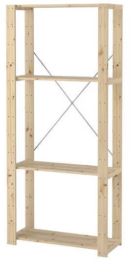

+++
title = "Story Time: Job #5: Part 4: Managed Security Provider - Downsizing"
date = "2024-07-30T15:01:09-03:00"
tags = ["storytime", "job05"]
+++

This is **Part 4** of a long series, [click here to see all the parts](/tags/job05/).



We had three of the biggest projects, concurrently running, you could do to your infrastructure:

* Migrating a Datacentre
* Migrating an office and server room
* Renaming a company

..and we had to complete them without any real budget, and having next to no idea about what we were doing!

## Moving Our London DC

### When A Site Visit Takes You Offline

I had a *Client Consultantion Visit* to a client in London, and tacked on to that site visit to our London DC in Telehouse. Jay had visited it before, and we had decided we wanted to move into a smaller, cheaper and more local DC. This visit was a bit of a site survey and we also had a list of small jobs that were impossible to do from all the way up in the North in Leeds.

The full height physical rack in London was mostly unused, and of the 4096 IP addresses we had, 99% of them were not used either. There was a complicated network set-up, where our IPv4 netblock (which was critical to us Doing Our Jobs.. as that netblock was allowlisted on every customer device that we had to access) was split and part of it was routed to our Leeds office with redundant* Cisco routers and switches.

_* Actual Redundancy May Vary_

This was my first experience of the *time dilation effect* of visiting a DC. What you think will take 5 minutes, seems to take hours.. So most of the "small jobs" we wanted to get done, I couldn't get done, either from running out of time, or just not having any of the equipment or remote support I needed.

The only thing I ended up checking off the list was "survey the site". I updated our out of date and inaccurate asset database.. and after losing many more hours than I had planned in that noisy, cold, and lonely DC, I was about ready to finish up my already long day...

One of the frustrating things was that I was not able to access our monitoring server, evidently we had never tried to VPN out of the DC itself..

Why was it was harder to access things **in** London **from** London? I had better network access from my desk in the Leeds office, which also had the bonus of being warm, relatively quiet and I could make myself a cup of tea! :laughing:

So, I called Jay and told him I'd got done what I could and was I OK to leave site? (As I couldn't check our monitoring interface from the DC). Jay was at the gym when I called him, as it was late in the evening. He said he hadn't received any alerts so I was fine to leave site... So left site and I trekked back to my hotel for some sleep, before the train home in the morning.

The next day I was about halfway home on the 4 hour train back up North, when Jay called, telling me that the entire London DC was offline, and had been offline since I was at the DC the evening before... :astonished: I gritted my teeth and prepared for the order to *Get Your Ass Back Down To Telehouse*... but he said they were seeing if they could get if fixed remotely.

Jay had no luck trying to get us back online so we'd had to call a London-based consultancy firm we'd grudgingly used in the past and beg them to send one of their engineers to Telehouse to try and help us. Their engineer eventually called us from Telehouse, and said that one of our Cisco network switches had crashed, and he'd power cycled it.

Which had gotten us back online.. :tada: .. The engineer was about the leave site... when we went offline again.. :fire: That switch seemed to only run for a few minutes before crashing...

The engineer said he could get hold of a spare Cisco switch and try copying our config over to it, which he did and we were actually working again :tada::tada:.

> Still to this day, I have no idea why this switch started crashing, maybe I bumped the power cord and it got fried somehow? Maybe the switch sensed it was about to go to the great recycling bin in the sky and fought back? (That was actually something I'd come across later in mostly-but-not-completely-sarcastic terms at a future job I had :thinking:)

Our business had been dead in the water for a couple of days (our bread and butter work of remote support didn't work when our allowlisted IPv4 block was offline, and our backup Leeds second-ISP connection couldn't access everything our main block could (due to lazy engineers!)), so we were relieved to back online.

The London-based consultancy then asked us what we wanted to do about the network switch they had "loaned" us, the *Managing Director* asked Jay and me, and we said "just buy it off them so we don't have anymore downtime and don't have to send one of us back down to London".. he didn't want to do this, as the rival company wanted £1000 for the switch. We told him, that's how much they cost, and if they take their switch back we won't **have** a company! (They did the right thing.. reluctantly.. after much arguing about  the wrong options first though..)

### Post-Outage

We got bitten by the complexity and half-finished-ness of the network set-up. It was complicated, but the High Availability reward for that complexity was shown to be a mirage. We got all the downsides of complexity and none of the upsides. In fact, it seemed like this was a *Low-Availability* network.

The IPv4 /20 netblock we had was routed to London, which then routed a subset of those IPs to Leeds. The problem we found was that if London was down, Leeds was down. If we wanted to access London we had to drive 4 hours to fix it, so it didn't make much sense.

Our plan then was to simplify our network, our Leeds office would just have an ADSL line and a small ISP-provided netblock, and our new DC would have a DC-provided small netblock and we would configure the new netblocks on **all** our customer kit, so we could still operate if either site was offline.

### The New DC

We scoped out a few local DCs and settled on one in York. We had realised we didn't need a full rack, and could downsize to a quarter rack. We got the new DC up and running over the course about half a year, adding new servers, new switches, and migrating the few services we ran in London into York.

We saved the company a lot of money as we had moved from an expensive DC to a cheaper DC, and were only renting a quarter of the space to boot.

Myself and Jay took great pride in this quarter-rack, we were pedantic about planning, labelling, colour-coding, cable management, documentation, everything.

## Moving Offices

The company had changed hands with several new owners taking over the company after the original founder moved on, but the trajectory was always downwards.

The current owners had a great idea to merge with an unrelated company that had a shared board-member with, this time it was a .NET Web Development company.

I was the only one in the company who was happy for the office move from a nice suburb of Leeds (which was my worst commute ever, my average speed was 14mph on a typical day) to move in to the office of the Web Dev company we'd merged with. The new office was just off an unremarkable motorway junction East of Leeds. Everyone else in the company's commute got worse, and aside from the commute benefit to me, it was a worse location. Our office was opposite a haulage warehouse, and the soundtrack was noisy diesel engines and the incessant *beep, beep* of reversing lorries.

### New Office Tour

We had a tour of the new office with one of the engineers from the Web Dev company. We got lead down into the basement where their existing server room was. They only had about 4 servers, rack mount servers, but I was shocked to see what they classed as a "rack".



They had three or four 1U servers on this Ikea shelving unit.. a wobbly wooden rack. They were all Windows boxes except for one Linux machine with the very creative hostname of "`debian`" :laughing:

We ended up with our own room in the basement, and we brought our own (metal) rack to store the servers in too :upside_down_face:

### (Failing To) Sell A Room Full Of Old Solaris Hardware on eBay

We didn't often get access to the back storage room in the Leeds office, I think because the Finance team kept their paperwork in there, but when we did get access to it, we found a ton of even older Sun hardware. We had already decided to ditch as much of the SPARC/Solaris kit and move to Intel/Linux. We knew it would cost a lot to securely dispose of the hardware, so we first tried to sell it on eBay.

We put up a bulk lot of a couple of dozen servers, the auction got very little interest, and we only had one or two bidders, and the winning bid was something paltry like £50.

As the auction neared the final days, we realised we'd underestimated the task of securely wiping the hard drives on this stack of servers. I powered up one of them on our test bench and managed to boot a live image that would write one pass of zeros to the disk. This was estimated to take 18 hours or so.

Doing the maths on the number of servers (and even being generous for the amount of space/power we had to run them all concurrently), we were talking a lot of our time to babysit the wiping.

We decided it was more trouble than it was worth and we messaged the winning bidder to say the best we could do was ship them with the hard drives removed (we'd use the trusty :hammer: wiping method, while still tedious to unscrew and remove all those hard drives, it would at least we could take out a bit of frustation on them!)

But.. the bidder turned down this offer and we ended up calling in a recycling firm instead to shred them wholesale. We already had a pile of kit that we needed to recycle (including the tape machine and every tape we could find from [Part 1](/blog/2024/05/story-time-job-05-p1-managed-security-provider/)), so it just made the pile a little taller!

We felt pretty disconcerted when we overheard the two recycling guys in our server room after we'd shown them the pile we wanted recycling

> "You ever seen any of this type of kit before?"

> "Nah, I haven't.. not sure it would sell for much on eBay.."

:woman_facepalming: Not our problem, we got a piece of paper saying they were sent off to be securely destroyed!

### Sorting Out The Ticketing Database

One of the most critical pieces of software to the business was their in-house CRM / Ticketing / Billing system known as **ESS**. It was written in C, looked decidedly 90s (there were even unironic `<blink>` tags sprinkled throughout!), but it was actually pretty good if you could get past the front-end.

There were two copies of it, the primary one running in Leeds, and a secondary in London. They both ran the web application and a MySQL database, the primary replicated to the secondary server. We collectively had next to zero knowledge of databases, and whenever we got an alert about replication being broken between the primary and secondary MySQL nodes, we really didn't know how to fix it, but we usually managed to silence the alarm somehow.

We'd identified that this was a risk when we were moving both the primary (Leeds) physical server to the new office, and moving the London server out of Telehouse. We didn't know how to failover to the secondary, didn't know what gotchas we were going to hit when the network and IP addresses of the servers changed, didn't have any staging or test instances and as it was completely bespoke we couldn't just Google for the answer.

So we got put in touch with an ex-engineer who had been at the company in the 90s and had written a good chunk of **ESS** in the first place. He'd left on good terms and our presales engineer had his contact details, so we called him up and offered to pay him for a few days of consulting if he was interested.

The Ex-Engineer came in, I helped him get set-up with a temporary account so he could get a shell on the **ESS** servers, and got ready to Learn Some Things!

Immediately he fired up a mysqlclient against `localhost`:

```shell
mysql -u root -p
Enter password: 
```

He sat there for a moment, and I started to unlock our password vault to retrieve the MySQL root password for him when I heard him typing, looked over to see

```shell
Welcome to the MySQL monitor.  Commands end with ; or \g.
mysql>
```

He'd left the company 5 or 6 years ago and still remembered the password (which evidently hadn't been changed since he left!)

Once he was in he found that the backup database was missing huge chunks of data, it turns out our instructions for *"fixing"* the replication issues was the just skip the missing data :woman_shrugging:, so if we'd ever tried to failover in an emergency we'd had catastrophic data loss!

He showed us how to migrate the boxes to new locations and gave us basics of how to correctly operate the MySQL databases as well. When we did migrate it, we didn't have any problems with **ESS**.

## Renaming A Company

We managed to rename just about everything that referred to the old company name, to the new company name.

The one thing we didn't attempt was the Windows Domain. I found a Microsoft KB support article that told you how to rename a domain, and just skimming the steps gave me nightmares. I think at one stage you had to reboot your domain controller **twice**, it looked like doom.

By the end of my time we'd even moved everyone's email addresses over to the new domain, and amazingly got the OK to remove the `MX` records from the old domains entirely, I think mainly because the person I asked had the oldest and most spammed email address so she was happy to get rid of the domain entirely!

We ran our own Authoritative DNS servers (of course!) and at one point I managed to b0rk our domains off the internet by switching the NS records over far too soon (and I think on a Friday... I was pretty junior at this point, reader :woman_facepalming:). I had to phone the domain registrar to beg them to fix the NS records for me, it was a bit of a mess! I learnt the lesson of being cautious when messing about with DNS after this.

## Conclusion

Looking back, these were amazing learning opportunities, I really learned so much, and realised that although I thought I wanted to get into *InfoSec*... really I loved building and running infrastructure.

This is the job that set me on this path of becoming a fully fledged Linux Systems Administrator / Platform Engineer :heart:.
