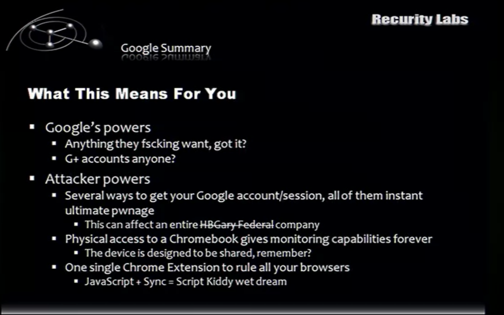
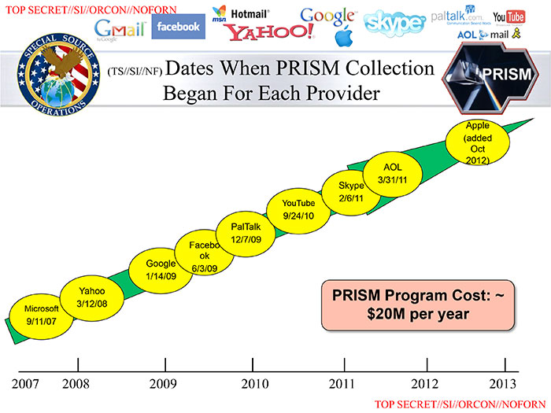

+++
title = "Self Hosting Email in 2024"
date = "2024-09-06"
tags = ["tech", "selfhosting"]
+++



# Introduction

It seems to be commonly held wisdom these days that self-hosting is great... but you'd be crazy to use it for **email**.

## My Email History circa 1996 - Present

### 1996 to 1999 - The Dial-Up Era

My Home ISPs when I was a kid would change fairly frequently, the mid-late 1990s saw an explosion in ISPs and I jumped around, usually always *having* a new email address at each ISP (Pipex, Nildram, Demon, BT Internet, LineOne), these I would abandon and lose access to frequently (thinking back, in the 1990s you didn't really need many sign-ups to websites).

### 1999 - 2003 - @unn.ac.uk / @ntlworld.com

Then I went to Uni and used the University address for a while (`@unn.ac.uk`), at the same time my home got out of the dial-up era and got *broadband* from our Cable TV provider - NTL (`@ntlworld.com`). I seemed to use that email address and the Uni one interchangably.

My parent's internet connection is still registered to that original email address that is 20+ years old now, but I don't check it.

The last time I did check it was when I wanted to dust off a copy of Half-Life 2, which required getting access to my pre-password manager Steam account, which required delving into thousands of old spam emails to get the password reset.

One thing I was amazed at was how I was still getting *Job Recruiters* emailing me for Helpdesk jobs - I evidently used that email address when I started job hunting right out of University, and they are still spamming me for Helpdesk jobs 10 years later?! (Great logic guys!)

I just logged in now and there was only a handful of emails post-2018 (GDPR?). There were about a thousand pre-2018 emails, going back to when Virgin Media insourced their email in 2011.

The worst offenders for spam?
* Buying a ticket to a dance night in the early 2000s got my email on a clearly passed around *eFlyer* list. No proper unsubscribe, and no point unsubscribing as the list was clearly still being traded around.
* Job Recruiters! Once they get an email address they never let it go.

### 2004 - 2011 - @gmail.com + Spamgourmet tagged

I got an invite when Gmail was in Beta and used that (happily!) for about 7 years, this was when Google was still in it's *"Don't be evil"* mode, and felt like the underdog.

I read all my email in Gmail's web interface. I used my `@gmail.com` address to email friends and companies, but mostly used Spamgourmet addresses when signing up for things on websites.

I'd learned the lesson somewhat that any email address you give to someone will be accidentally leaked or deliberately spammed given enough time, so I used a service called [Spamgourmet](https://www.spamgourmet.com) which allowed you to do tagged emails, with an option to specify how emails to allow each tagged address to receive before future emails would be "eaten".

Spamgourmet is still alive and kicking, and my account gives me the following stats:

> Your message stats: 4,370 forwarded, 18,304 eaten. You have 328 spamgourmet address(es). 

It meant changing my email address wasn't as painful, as most of my logons were using `@spamgourmet.com` email addresses, and I could just change all those logons from forwarding to `@gmail.com` over to my new domain in a few clicks.

## Why Did I Decide To Ditch Gmail?

I got spooked at the end of 2011 watching a security talk entitled [Apple vs. Google Client Platforms: How you end up being the Victim](https://media.ccc.de/v/28c3-4676-en-apple_vs_google_client_platforms#t=2652) that covered the myriad ways that these hackers could get your Google auth cookie and compromise your entire Google (and thus Gmail) account.

Here's a screenshot from that talk:



I think even if I'd not caught this talk, I remember being pretty angry when I read about [PRISM](https://en.wikipedia.org/wiki/PRISM) (that made me delete my Facebook account!) so I probably would have ditched Gmail as well.



### 2012 - Present - Self-hosted at my own domain

Why not just switch to another email provider.. why *self-hosting*?

Mainly because by virtue of my work as a SysAdmin I'd already had 4 years of free on-the-job training [about how to host mail](/blog/2024/06/story-time-job-05-p2-managed-security-provider/), how to relay mail and how to fight spam, and I obviously knew how to maintain and configure Linux boxes, so I went ahead and did it.

So I registered my own `co.uk` domain a few weeks later and set up Dovecot and Postfix manually on a cheap VPS and slowly migrated all my email usage onto this new set-up.

I figured it wasn't much of a risk, as I could give up on the idea if I didn't like it, and as anyone who's ever changed an email address, you keep the old one running for a while to catch things you missed. So I kept my Gmail account going for a while in parallel.

## Hardest Thing About Ditching Gmail?

### Challenge 1 - A Good Webmail Client

Gmail's web interface is really good. I'd forgone desktop email clients for 7 years and got used to email being just another tab in my web browser. I looked around desperately for an equivalent open source webmail frontend. I seem to remember using [Roundcube](https://roundcube.net/) for a while, but eventually the input lag (even when accessing it on a LAN on a powerful server that was accessing IMAP over localhost) annoyed me to the point that I stopped using it.

If you can get over the lag, it's a decent alternative.

For me though I gave up on webmail clients and switched to fat email clients, [Thunderbird](https://www.thunderbird.net/) on my desktop/laptop and the built-in Apple Mail client on my smartphone. They require a bit of fiddly one-off set-up, but once they're set up, they just work.

**Replacement**: Thunderbird / Apple Mail

### Challenge 2 - Isn't It Impossible To Email Google/Yahoo/Microsoft Though?

*Short answer*: Yes, unless you cheat and use a 3rd party for *outgoing email*.

*Long answer*:

I did actually use my own MX for incoming *and* outgoing email from 2012 - 2021, when I finally threw in the towel on *outgoing* email. I was kinda sick of deliverability issues and had basically given up on sending emails where I could reach the person via other means (instant messengers).

The conventional wisdom that the uncaring beheamoths of Google, Microsoft, Yahoo and Apple will send your email to Junk frequently, for no good reason *is correct* in my experience.

Sending cold emails would make me tense, especially if I'd not emailed that person/company before, and if I didn't receive a quick reply I would assume my email had been sent to the Junk folder (which it often had, but not always).

And yes, this is despite following every email best practice:

* Not sending unsolicited spam (easy- I had the same IP address for years and year, and it was a one user system)
* Forward and reverse matching DNS
* SPF, DKIM, DMARC etc

Finally in 2021 I waved the white flag and reconfigured my MX to relay outgoing email through Amazon SES on an AWS account I had created just for this purpose. I had to jump through some hoops to get my SES account out of the *Sandbox* (raise a support ticket, answer some questions about what you're using it for etc). This was approved and away I went.

> `relayhost = [email-smtp.eu-west-1.amazonaws.com]:465`

This worked perfectly, technically it *could* incur a bill, but my usage was so low it rounded down to **£0.00**.

A year later I set up a new AWS account and tried to set up SES again, but this time my support ticket to get out of the *Sandbox* was refused multiple times, so I ended up giving up on AWS SES and moving to **Sendgrid** who offer a free plan of 100 emails per day.

I've been using Sendgrid since 2022 with no issues, and anecdotally haven't been aware of an email of mine going to the Junk folder (if I have its way better than it was pre-white flag)!

> `relayhost = [smtp.sendgrid.net]:465`

**Replacement**: Sendgrid

### Challenge 3 - Calendar/Contact/File Sync

File sync was pretty easy, ownCloud and NextCloud are both great for that. I've run them variously on home-based NAS server, home-based Raspberry Pi and VPSs.

But a reliable calendar / contacts replacement was way harder to get working than email!

#### ownCloud (2012 - 2018)

[ownCloud](https://owncloud.com/) (and NextCloud) are kinda billed as an "everything" applications, as I was basically using it just for Contacts/Calendar/File sync (and generally just a single user too), it felt like a complicated solution.

The calendar and contacts functionality was also kinda buggy, I really struggled to get it to work reliably, the hardest part was the initial import of my Gmail calendar export `.ics` file (credit where it's due, Google do make it easy to download your data - and this was pre-GDPR).

It did work and I used it up until I discovered Radicale in 2016. I kept ownCloud, but just for it's file sync functionality.

#### Radicale (2016 - Present)

I am still using [Radicale](https://radicale.org/) which is a lightweight Cal/CardDAV server, and once I figured out the correct incantation of how to configure users, calendars and reverse-proxy paths (all config-file based, no WebUI), it works great for me today.

#### NextCloud (2018 - Present)

Worth mentioning, I switched out NextCloud for file syncing in 2018, as I only use the file sync functionality it's very easy to upgrade (I generally nuke everything and start from a clean install).

It has always been a single user system, so I don't have to worry about causing other users issues, which allows me to make the decisions solely about what level of service I need.

**Replacement**: Radicale and NextCloud

## Easiest Things

### Mail Software

Using Postfix and Dovecot has been a decision I have never regretted. They are amazingly mature and solid projects, I configured them once to get them talking to each other, but after that I've barely had to touch them. Dovecot especially has been zero maintenance.

### Anti-Spam

This one could be the death of me, but I've (almost exclusively) not had long lived email addresses, I used tagged address for almost everything.

So the first spam email I receive to a tagged email address is the last email that tagged address will ever deliver! I add that now-spammy email address to a file full of other burned addresses that end in `REJECT Spamtrap`. Over 10 years I've only got about 100 email addresses on this list.

I do have *some* anti-spam, but only connection-based, so DNSBL lookups to Spamhaus.

I've configured Postfix to have a list of given email addresses that I can't `REJECT` outright, and these have this:

```
restrictive =
     reject_unknown_client_hostname,
     reject_rbl_client zen.spamhaus.org=127.0.0.[2..11],
     reject_rhsbl_sender dbl.spamhaus.org=127.0.1.[2..99],
     reject_rhsbl_helo dbl.spamhaus.org=127.0.1.[2..99],
     reject_rhsbl_reverse_client dbl.spamhaus.org=127.0.1.[2..99],
     warn_if_reject reject_rbl_client zen.spamhaus.org=127.255.255.[1..255],
```

I've managed to go 12 years without having content-based anti-spam. I'm sure I'll have to enable it one day, but for now I've managed without.

## Hosting Locations

Once I'd got a working manual set-up I migrated it to an Ansible roles. I have migrated the hosts around through various LowEndBox-style VPSes, Raspberry Pi, home NAS servers, and cloud provider's free instance offerings.

The MX has consistently been a VPS, the IMAP/Contacts/Calendar stuff has oscillated between VPS and home servers.

I do have the luxury of it being a single-user system, so if I do incur downtime (planned or unplanned), I generally only have myself to blame! :smile:

The only things I need to back up are the state (mailboxes, cal/contact data), which I backup to [Backblaze](https://www.backblaze.com), it's only single digits gigabytes, so very very cheap.

The server config is captured in my ansible git repository (spelunking through the git history is how I've been able to grab dates for this article), so doesn't need backing up.

I keep the servers running the latest Ubuntu LTS release, so it means a decent upgrade (in place or clean install depending on the hosting provider) every 2 years, which I could push to every 4-5 years if I felt like it.

## Conclusion

Would you recommend Self-Hosting Email in 2024?

**Answer**: It works for me, but it's complicated and you might not see the benefits being worth the cost.

The downsides to this approach is if you did migrate to self-hosted email, the more bespoke make your set-up, the more difficult (and expensive) it would be to migrate to a managed service down the road.
