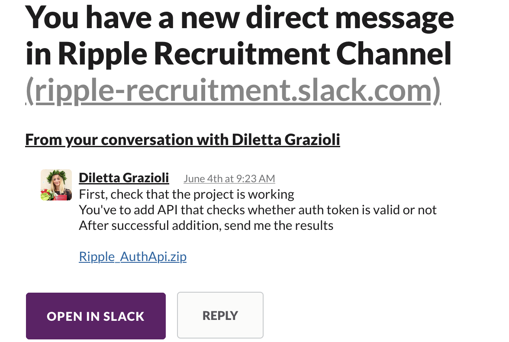
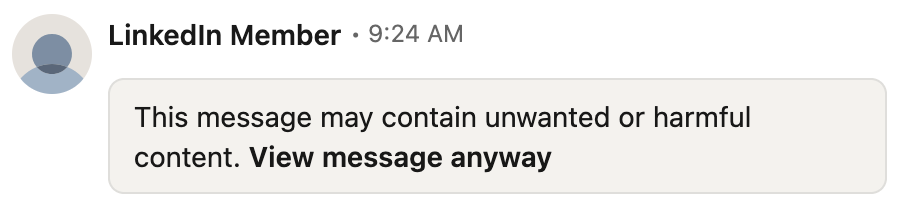
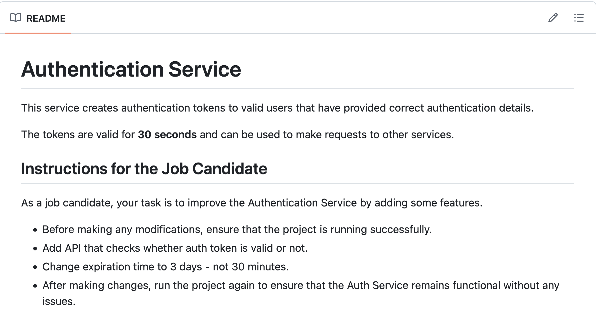
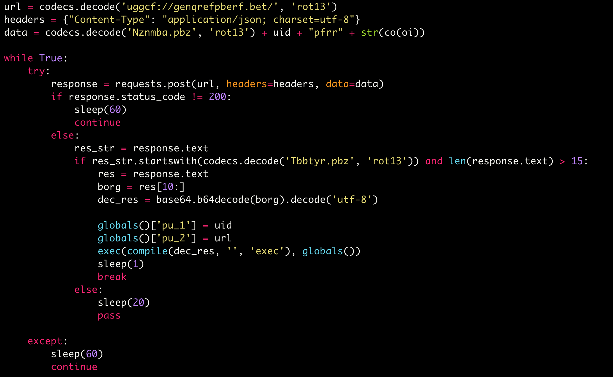

+++
title = "Anatomy of a Recruitment Phish"
date = "2025-06-04"
tags = ["tech",]
+++



## Introduction

So I nearly got scammed by a phisher posing as a recruiter on LinkedIn.

I got a message from a recruiter on LinkedIn, it was a long job description, said I was a good fit and they purported to be hiring for Ripple.


I read the job description, and told them I was not a good fit by pointing out I lacked some of the key experience they required.

They said, that doesn't matter (:red_circle: Red Flag #1). I asked about compensation and they gave a high number. I said I'd be interested to talk to them, and they asked me for my email address. I gave them a tagged email address, and received a Slack invite. I joined the Slack server and the recruiter messaged me there and said that the next step was to do a take-home Python coding test.


I didn't want to waste my time (free labour!) doing a tech test, without hearing a bit more about the role, so I asked for a call, the recruiter said "we can talk after the tech test". This seemed strange, definitely not the usual order of things. I asked for more details on the company (answered fine), and asked what the interview stages were, they said "tech test, video call, offer". This was :red_circle: Red Flag #2 based on my recent experience to have such a short process. I shrugged and said that I was very busy and that I would get back to them to get the test.

Later that day I was thinking over this interaction and I started to feel like something was not right, I went back on LinkedIn and checked the recruiters profile (looked legit) contact details (just listed a @hotmail.com email address), and thought "how do I know that this recruiter actually works for Ripple?". The Slack instance said `ripple-recruitment` but anyone could register that..

I asked them for the tech test, intended to then ask them to prove they worked for ripple (by asking them to send me an email from an official @ripple domain), but wanted to get the test from them first in case they disappeared.



Well, I got the test, asked the question and did not get an immediate response. When I next checked the Slack tab was logged out, and the LinkedIn profile had presumably being nuked for abuse (not me, but I would have reported the profile had it not been nuked already).



## So What Was The Phish?

I opened up a terminal and unzipped `Ripple_AuthApi.zip` into a temporary directory. I checked the README.md and it looked convincing.



There were 58,000 lines of python spread across 144 `.py` files spread in a convincing directory structure. I wasn't going to eyeball this.. but I had a hunch that the badness would be a suspicious base64 encoded string hidden in one of the files.

I did a grep for a regex for the base64 character set that were greater than 50 characters long, and got three hits, and the first one was the jackpot, it was a *reaaally* long string that wrapped my terminal 14 times.

```bash
grep -rE '[a-zA-Z0-9]{50,}'
./flask/sessions.py:    req_self = "aW1wb3J0IHN0cmJhbmRvbQ0KaW1fdfdd4
vcnQgc2xlZXANCmltcaW1wb3J0IHN0cmJhbmRvbQ0KaW1N0cmJhbmRvbQN0cmJhbmRvbQ
wgJ3JvdDEzJyk6DQogCA9ICIxMjM0NTY3ODdCA9ICIxMjM0NTY3ODdCA9ICIxMjM0NTY3
CA9ICIxMjM0NTY3ODdJyk6DQogCA9ICIxMjJyk6DQogCA9ICIxMjJyk6DQogCA9ICIxMj
ICAgcmV0dXJuIHJlcdnQgc2xlZXANCmltnQgc2xlZXANCmltnQgc2xlZXANCmltnQgc2f
vcnQgc2xlZXANCmltcaW1wb3J0IHN0cmJhbmRvbQ0KaW1N0cmJhbmRvbQN0cmJhbmRvbQ
wgJ3JvdDEzJyk6DQogCA9ICIxMjM0NTY3ODdCA9ICIxMjM0NTY3ODdCA9ICIxMjM0NTY3
CA9ICIxMjM0NTY3ODdJyk6DQogCA9ICIxMjJyk6DQogCA9ICIxMjJyk6DQogCA9ICIxMj
ICAgcmV0dXJuIHJlcdnQgc2xlZXANCmltnQgc2xlZXANCmltnQgc2xlZXANCmltnQgc=="
./werkzeug/security.py:SALT_CHARS = "abcdefghijklmnopqrstuvwxyz<snip>"
./README.md:    "token": "eyJ0eXAiOiJKV1QiLCJhbGciOiJIUzI1NiJ9.<snip>"
```

I base64 decoded the `req_self` string (which further down the `sessions.py` file would `eval` this...)



There we go, looks to be sending a POST to a remote web server (:clown_face: loving the ROT13 encryption (I'm joking!)!) and then executing the code if we like the response.

## Lessons Learned

I'm going to be more careful in future, I think if I'd been in a hurry I could very well have fallen for this. Especially if they'd burned 30 minutes of time to talk to me to put my mind at rest.

I have pushed this code, defanged, [to this GitHub repository](https://github.com/mackenzie-remote/linkedin-phish) if you want to see the full code, I've only modified that one line and added an intro the README.md

This is the new defanged backdoor for reference:

```python
print("if you saw this message you would have been pwned!")
```

The backdoored file is [flask/sessions.py#L108](https://github.com/mackenzie-remote/linkedin-phish/blob/main/flask/sessions.py#L108)
